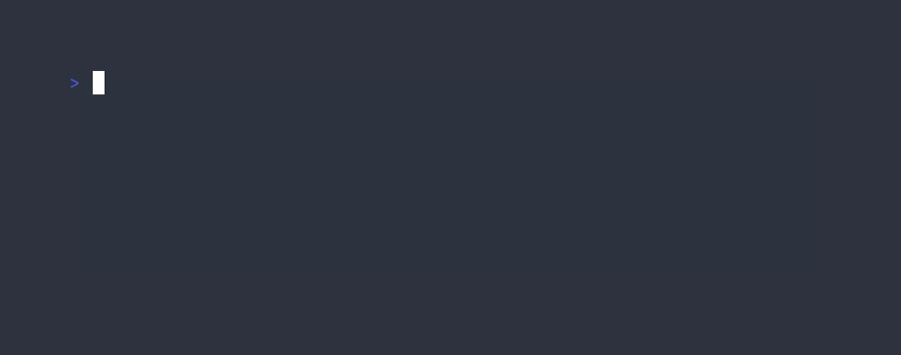

# gobarchar

[](https://github.com/usrme/gobarchar/actions/workflows/test.yml)
[](https://goreportcard.com/report/github.com/usrme/gobarchar)

For whatever reason, I was enamored with [Alex Chan's snippet of code](https://alexwlchan.net/2018/ascii-bar-charts/) where a key-value pair list is turned into a passable bar chart for quick demonstration purposes. When writing a [blog post mentioning the number of books I've read](https://usrme.xyz/posts/glee-in-2023/#books-read) I wanted to quickly visualize the values, but didn't want to spend too much time on it. The solution above worked wonders! But I wanted the same thing without having to actually open a terminal (heresy, I know), thus this thing was born: the graphing solution that might not suit you 📊



## Features

- Send data and get graph back
- Perform calculation for average to the nearest integer
- Perform calculation for sum of all values
- Sort ascending or descending, or don't sort at all
- Maybe coming: change layout from horizontal to vertical!

## Usage

### On the Fly

(Excuse the pun). Instead of installing the thing, you can also access the same functionality using the instance hosted on [Fly](https://fly.io/) at https://gobarchar.fly.dev/:

```console
$ curl "https://gobarchar.fly.dev/?2012=8&2013=6&2014=8&2015=14"
2012     8 ██████████████▎
2013     6 ██████████▋
2014     8 ██████████████▎
2015    14 ████████████████████████▉
Avg.     9 ████████████████
Total   36 ████████████████████████
```

It should always be available for usage, but if it's not then do open up an issue and I'll see what I can do.

### Local

After [installation](#installation), execute `gobarchar`, which by default starts a web server listening on port 8080, though you can specify a different port through the `PORT` environment variable. Once the web server is running, you can use something like `curl` to perform requests to it using query parameters to specify the data to be graphed:

```console
$ # First session
$ ./gobarchar
2024/01/07 20:02:20 listening on: 8080
$ # Second session
$ curl "http://localhost:8080/?2012=8&2013=6&2014=8&2015=14"
2012     8 ██████████████▎
2013     6 ██████████▋
2014     8 ██████████████▎
2015    14 ████████████████████████▉
Avg.     9 ████████████████
Total   36 ████████████████████████
$ # First session
2024/01/07 20:02:20 listening on: 8080
2024/01/07 20:02:29 completed in: 145.072µs
```

## Installation

- using `go install`:

```bash
go install github.com/usrme/gobarchar@latest
```

- download a binary from the [releases](https://github.com/usrme/gobarchar/releases) page

- build it yourself (requires Go 1.21+):

```bash
git clone https://github.com/usrme/gobarchar.git
cd gobarchar
go build
```

## Removal

```bash
rm -f "${GOPATH}/bin/gobarchar"
rm -rf "${GOPATH}/pkg/mod/github.com/usrme/gobarchar*"
```

## Acknowledgments

Heavily inspired by the ['Drawing ASCII bar charts' blog post](https://alexwlchan.net/2018/ascii-bar-charts/) by Alex Chan.

## License

[MIT](/LICENSE)
